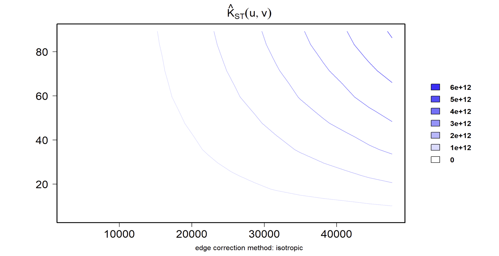

## 1 Overview

A spatio-temporal point process (also called space-time or spatial-temporal point process) is a random collection of points, where each point represents the time and location of an event. Examples of events include incidence of disease, sightings or births of a species, or the occurrences of fires, earthquakes, lightning strikes, tsunamis, or volcanic eruptions.

The analysis of spatio-temporal point patterns is becoming increasingly necessary, given the rapid emergence of geographically and temporally indexed data in a wide range of fields. A range of methods for this type of analysis has been developed and implemented in R over the past decade, and this exercise draws on several of them.

For this exercise, forest fire events recorded in Kepulauan Bangka Belitung, Indonesia between 1 January 2023 and 31 December 2023 are used to illustrate the methods, procedures, and interpretations of spatio-temporal point pattern analysis.

**Two specific questions guide this analysis:**

- Do forest fire locations in Kepulauan Bangka Belitung show spatial and spatio-temporal independence?
- If independence does not hold, where are the clusters concentrated, and during which periods do they occur?

## 2 The Data

| Dataset | Format | Source | Description |
|------------------|------------------|------------------|------------------|
| **forestfires** | CSV | [Fire Information for Resource Management System (FIRMS)](https://firms.modaps.eosdis.nasa.gov/download/) | Provides locations of forest fires detected by the Moderate Resolution Imaging Spectroradiometer (MODIS) sensor. Only fires within Kepulauan Bangka Belitung are retained for this exercise. |
| **Kepulauan_Bangka_Belitung** | ESRI Shapefile | [Indonesia Geospasial](https://www.indonesia-geospasial.com/2023/05/download-shapefile-batas-administrasi.html) | Provides sub-district (*kelurahan*) boundaries of Kepulauan Bangka Belitung. The source data covers the whole of Indonesia; only sub-districts within Kepulauan Bangka Belitung are extracted for this exercise. |

## 3 Installing and Loading R Packages

Six R packages are used for this exercise:

| Package | Purpose |
|------------------------------------|------------------------------------|
| [**sf**](https://r-spatial.github.io/sf/) | Imports, processes, and wrangles geospatial vector data |
| [**spatstat**](https://cran.r-project.org/web/packages/spatstat/index.html) | Performs spatial point pattern analysis, including cross-type functions such as *Kcross()* and *Lcross()* |
| [**sparr**](https://tilmandavies.github.io/sparr/index.html) | Estimates fixed and adaptive kernel-smoothed spatial relative risk surfaces via the density-ratio method, performs subsequent inference, and supports fixed-bandwidth spatio-temporal density and relative risk estimation |
| [**stpp**](https://cran.r-project.org/web/packages/stpp/index.html) | Simulates, plots, and analyses spatio-temporal point patterns, including the space-time K-function used later in this exercise |
| [**tmap**](https://r-tmap.github.io/tmap/) | Produces cartographic-quality thematic maps |
| [**tidyverse**](https://www.tidyverse.org/) | A collection of packages supporting common data science tasks, including data import, transformation, wrangling, and visualisation |

```{r}
pacman::p_load(sf, spatstat, sparr, 
               stpp, tmap, tidyverse)
```

## 4 Importing and Preparing Study Area

### 4.1 Importing Study Area

The study area boundary for **Kepulauan Bangka Belitung** is imported using `st_read()`. The nationwide sub-district boundary shapefile is imported, and `glimpse()` is used to inspect its attribute table structure.

```{r}
kbb_raw <- st_read(dsn = "data/BATAS WILAYAH KELURAHAN-DESA 10K",
                    layer = "Batas_Wilayah_KelurahanDesa_10K_AR")

# Check the attribute table structure
glimpse(kbb_raw)
```

The `WADMPR` column is identified as the province field, and `unique()` is used to confirm the exact string used for Kepulauan Bangka Belitung.

```{r}
unique(kbb_raw$WADMPR)
```

The dataset is filtered to retain only sub-districts within Kepulauan Bangka Belitung, and the result is plotted to visually confirm that the correct study area was extracted.

```{r}
kbb_sf <- kbb_raw %>%
  filter(WADMPR == "Kepulauan Bangka Belitung")

plot(st_geometry(kbb_sf))
```

The filtered dataset is then exported as a standalone shapefile, keeping the study area self-contained and independent of the raw source file.

```{r}
#| output: false
st_write(kbb_sf,
         dsn = "data",
         layer = "Kepulauan_Bangka_Belitung",
         driver = "ESRI Shapefile",
         delete_layer = TRUE)
```

The filtered **Kepulauan_Bangka_Belitung** shapefile is imported into the R environment.

```{r}
kbb_sf <- st_read(dsn = "data", 
                  layer = "Kepulauan_Bangka_Belitung") %>%
  st_union() %>%
  st_zm(drop = TRUE, what = "ZM") %>%
  st_transform(crs = 32748)
```

::: callout-note
The coordinate reference system used here is EPSG:32748 (WGS 84 / UTM zone 48S), the appropriate projected CRS for Kepulauan Bangka Belitung's location in Indonesia.
:::

### 4.2 Converting to owin

Next, `as.owin()` converts the prepared boundary into an **owin** object, which is the spatial window format required by **spatstat** for point pattern analysis:

```{r}
kbb_owin <- as.owin(kbb_sf)
kbb_owin
```

`class()` is used to confirm that the output is an **owin** object:

```{r}
class(kbb_owin)
```

## 5 Importing and Preparing the Forest Fire Data

The forest fire dataset is imported, and `glimpse()` is used to inspect its column names and data types before any processing is applied.

```{r}
fire_raw <- read_csv("data/forestfires.csv")
glimpse(fire_raw)
```

The fire data is converted into an sf object using `st_as_sf()`, reprojected to EPSG:32748 using `st_transform()` (matching the coordinate reference system used for the study area boundary), then filtered to retain only fire points falling within the Kepulauan Bangka Belitung boundary using `st_filter()`.

```{r}
fire_sf <- fire_raw %>%
  st_as_sf(coords = c("longitude", "latitude"), crs = 4326) %>%
  st_transform(crs = 32748) %>%
  st_filter(kbb_sf)
```

::: callout-note
The forest fire data was downloaded for the whole of Indonesia (53,128 records spanning multiple islands), so `st_filter()` is included here to retain only fire points within the study area.
:::

As spatstat's point pattern objects require numeric marks instead of date objects, three time-based fields are derived from acq_date using mutate():

- **DayOfYear** (the numeric day of the year, 1–365)
- **Month_num** (the calendar month as a number, 1–12)
- **Month_fac** (the calendar month as a labeled factor, e.g. "January")

```{r}
fire_sf <- fire_sf %>%
  mutate(DayOfYear = yday(acq_date),
         Month_num = month(acq_date),
         Month_fac = month(acq_date, label = TRUE, abbr = FALSE))
```

## 6 Visualising the Fire Points

### 6.1 Overall Plot

An overall map is prepared to visualise the spatial distribution of all forest fire events in Kepulauan Bangka Belitung, Indonesia for 2023.

```{r}
tm_shape(kbb_sf) +
  tm_polygons() +
tm_shape(fire_sf) +
  tm_dots()
```

### 6.2 Visualising Geographic Distribution of Forest Fires By Month

The maps below show the monthly geographic distribution of forest fires across Kepulauan Bangka Belitung.

```{r}
#| fig-width: 10
#| fig-height: 8
tm_shape(kbb_sf)+
  tm_polygons() +
tm_shape(fire_sf) +
  tm_dots(size = 0.2, fill = "red") +
tm_facets(by="Month_fac", 
          free.coords = FALSE, 
          drop.units = TRUE)
```

::: callout-note
**Analysis:**

The pattern reflected is consistent with Indonesia's known dry season and fire cycle. The country's dry season typically spans from around April to October, with fire activity peaking between August and October. 2023 was especially severe, marking Indonesia's worst fire season since 2019, driven by an intense El Nino event that dried out vegetation nationwide. Since burning in Indonesia is more commonly linked to agricultural land clearing than to natural causes, the July to October spike observed here likely reflects both the seasonal dry conditions and land-clearing activity concentrated during that period.
:::

## 7 Computing STKDE by Month

This section covers STKDE computation using [spattemp.density()](https://tilmandavies.github.io/sparr/reference/spattemp.density.html) from **sparr**.

### 7.1 Extracting Forest Fires by Month

Since `as.ppp()` only requires the mark field and geometry field from the input sf data frame, unwanted columns are removed, retaining only `Month_num`.

```{r}
fire_month <- fire_sf %>%
  select(Month_num)
```

### 7.2 Creating the ppp object

`as.ppp()` converts fire_month into a marked planar point pattern object:

```{r}
fire_month_ppp <- as.ppp(fire_month)
fire_month_ppp
```

The code below is used to confirm the object's structure and check for anything unexpected.

```{r}
summary(fire_month_ppp)
```

::: callout-note
**Analysis:**

From the above summary, it shows a mean of 8.644, indicating that the average fire event occurred slightly later in the year. This is consistent with the earlier monthly facet maps, where fire activity was concentrated in the July to October period, pulling the mean upward.
:::

Next, `any(duplicated())` checks if there are any duplicated point events:

```{r}
any(duplicated(fire_month_ppp))
```

### 7.3 Including the owin object

`fire_month_ppp` is combined with the `kbb_owin` study area boundary, restricting the point pattern to the actual province outline:

```{r}
fire_month_owin <- fire_month_ppp[kbb_owin]
summary(fire_month_owin)
```

::: callout-note
The window consists of **536 separate polygons** instead of one connected polygon because Kepulauan Bangka Belitung is an archipelago. Its two main islands, Bangka and Belitung, along with many smaller surrounding islands, are all separated by open sea and do not share a land border. *st_union()* can only merge polygons that physically touch, so each island stays as its own separate piece within the combined boundary.
:::

The result is plotted to confirm the point pattern is correctly bounded by the study area.

```{r}
#| fig-width: 8
#| fig-height: 6
plot(fire_month_owin)
```

### 7.4 Computing Spatio-temporal KDE

`spattemp.density()` from **sparr** is used to compute the STKDE.

```{r}
st_kde <- spattemp.density(fire_month_owin)
summary(st_kde)
```

### 7.5 Plotting the Spatio-temporal KDE Object

The code below is used to visualise the KDE surfaces from July to December 2023:

```{r}
#| fig-width: 10
#| fig-height: 8
tims <- c(7,8,9,10,11,12)
par(mfcol=c(2,3))
for(i in tims){
  plot(st_kde, i,
       override.par=FALSE,
       fix.range=TRUE,
       main=paste("KDE at month",i))
}
```

The KDE surfaces show a clear intensification and decline across the second half of 2023. July and August show moderate density concentrated on Bangka Island's western side, appearing as a purple-to-pink hotspot. This intensifies sharply in September, then peaks in October, where the hotspot turns bright orange-to-yellow, indicating the highest estimated fire density of any month shown. By November, the hotspot has faded back toward purple/blue, and December shows minimal density across the entire study area.

Belitung Island and the surrounding smaller islands generally show low density across the six months, though September and October show a modest increase. This indicates fire activity in 2023 was concentrated mainly on Bangka Island, with Belitung experiencing comparatively minor fire activity during the same period.

::: callout-note
**Analysis:**

October stands out as the single most intense month, consistent with the July to October fire season pattern identified in the earlier monthly forest fire maps.
:::

## 8 Computing STKDE by Day of Year

This section covers computing STKDE using fire occurrence by day of year instead of by month.

### 8.1 Extracting Forest Fires by Day of Year

Unwanted columns are removed from the fire point data, retaining only `DayOfYear`.

```{r}
fire_yday <- fire_sf %>%
  select(DayOfYear)
```

### 8.2 Creating the ppp object

`as.ppp()` converts fire_yday into a marked planar point pattern object:

```{r}
fire_yday_ppp <- as.ppp(fire_yday)
fire_yday_ppp
```

### 8.3 Including the owin object

The ppp object is combined with the `kbb_owin` study area boundary:

```{r}
fire_yday_owin <- fire_yday_ppp[kbb_owin]
summary(fire_yday_owin)
```

### 8.4 Computing Spatio-temporal KDE

`spattemp.density()` from **sparr** is used to compute the STKDE.

```{r}
kde_yday <- spattemp.density(fire_yday_owin)
summary(kde_yday)
```

::: callout-note
The spatial bandwidth (h = 19110) is identical to the monthly STKDE, since both use the same `kbb_owin` window. The temporal bandwidth (lambda = 6.4541) is much larger than the monthly version's lambda (0.0264), but this reflects the different scales used to measure time rather than a real difference in smoothing: `DayOfYear` spans a much wider numeric range (10 to 360) than `Month_num` (1 to 12), so a larger bandwidth value is expected.
:::

### 8.5 Plotting the Spatio-temporal KDE Object

```{r}
plot(kde_yday)
```

## 9 Computing STKDE by Day of Year (Improved Method)

`BOOT.spattemp()` from **sparr** performs bootstrap-based bandwidth selection for spatio-temporal density estimation, optimizing both the spatial and temporal bandwidths by minimizing an estimate of the Mean Integrated Squared Error (MISE), rather than relying on the automatic bandwidth selection used in the previous sections. The spatial bandwidth returned is isotropic, meaning the same amount of smoothing is applied in every direction, rather than allowing smoothing to vary by direction.

```{r}
set.seed(123)  #ensure reproducible results
BOOT.spattemp(fire_yday_owin)
```

### 9.1 Computing Spatio-temporal KDE

The STKDE is derived using the h and lambda values obtained from `BOOT.spattemp()` in the previous step.

```{r}
kde_yday <- spattemp.density(fire_yday_owin,
                              h = 45000,
                              lambda = 19)
summary(kde_yday)
```

### 9.2 Plotting the Spatio-temporal KDE Object

The resulting spatio-temporal KDE surfaces are shown below.

```{r}
plot(kde_yday)
```

## 10 Spatio-temporal Point Patterns Analysis: stpp methods

This section covers spatio-temporal point pattern analysis using functions from the [**stpp**](https://www.jstatsoft.org/article/view/v053i02) package.

### 10.1 Preparing the Spatio-temporal Point Process Object for stpp

**Step 1:** Extracting forest fire coordinates from the fire point events

```{r}
coords <- st_coordinates(fire_sf)
```

**Step 2:** Creating a data frame by combining the x- and y-coordinates and temporal event. *Note that the temporal event must be in integer.*

```{r}
fire_df <- data.frame(
  x = coords[, 1],
  y = coords[, 2],
  t = fire_sf$DayOfYear
)
```

**Step 3:** Creating stpp spatio-temporal object `as.3dpoints()` is used to convert the data frame into an stpp spatio-temporal object.

```{r}
fire_stpp <- as.3dpoints(fire_df)
class(fire_stpp)
```

The result can be visualised below:

```{r}
plot(fire_stpp)
```

::: callout-note
**Analysis:**

The xy-locations plot shows fire events split into two separate clusters, one over Bangka Island and a smaller one over Belitung and its nearby islands, with a clear gap between them where the sea separates the two.

The cumulative number panel shows the total fire count increasing slowly from January to May, then climbing sharply from around July to November, before levelling off toward the end of the year. This steep rise corresponds to the fire season identified in the earlier monthly maps and KDE surfaces.
:::

### 10.2 Computing spatio-temporal K-function

[STIKhat()](https://cran.r-project.org/web/packages/stpp/refman/stpp.html#STIKhat) from **stpp** is used to compute the space-time inhomogeneous K-function.

```{r}
kbb_stik <- STIKhat(fire_stpp)
kbb_stik
```

The result can be visualised using `plotK()`.

```{r}
#| eval: false
plotK(kbb_stik)
```



::: {.callout-note}
**Analysis:** 

No contour lines appear near the bottom-left of the plot (short spatial distance, short time lag), since the K-function values there fall below the lowest threshold shown. Contour lines begin to appear only at moderate distances and time lags, then fan out in a rippling pattern towards the top-right, with lines becoming more closely spaced as both u and v increase. This pattern is consistent with forest fire events in Kepulauan Bangka Belitung not being independent in space and time. A comparison against the theoretical K-function under spatial randomness would be needed to confirm this statistically.
:::

### 10.3 Comparing observed and theoretical K-function values

While the contour plot visually suggests spatio-temporal clustering, a more rigorous check compares the observed K-function (`Khat`) against the theoretical K-function expected under complete spatial randomness (CSR) (`Ktheo`). A ratio greater than 1 indicates observed clustering exceeds what randomness alone would predict.

```{r}
k_ratio <- kbb_stik$Khat / kbb_stik$Ktheo
summary(as.vector(k_ratio))
```

::: {.callout-note}
**Analysis:** 

Every value in the Khat/Ktheo ratio exceeds 1, ranging from a minimum of 4.80 to a maximum of 100.69, with a median of 8.22. This confirms that forest fire events in Kepulauan Bangka Belitung are not spatially and temporally independent, the observed K-function consistently exceeds what would be expected under CSR, at every distance and time lag examined. 

This answers the exercise's first question: forest fire locations are spatially and spatio-temporally clustered, not independent. The second question, where and when fires tend to cluster, is addressed by the KDE surfaces from earlier sections: the density surfaces consistently showed the highest concentration of fire activity on Bangka Island's western side, with intensity peaking during the July to October period.
:::

## 11 Reference

Peter Hall (1990) "[Using the Bootstrap to Estimate Mean Squared Error and Select Smoothing Parameter in Nonparametric Problems](http://www.sciencedirect.com/science/article/pii/0047-259X(90)90080-2)", *Journal of Multivariate Analysis*, Vol. 32, pp. 177-203.
