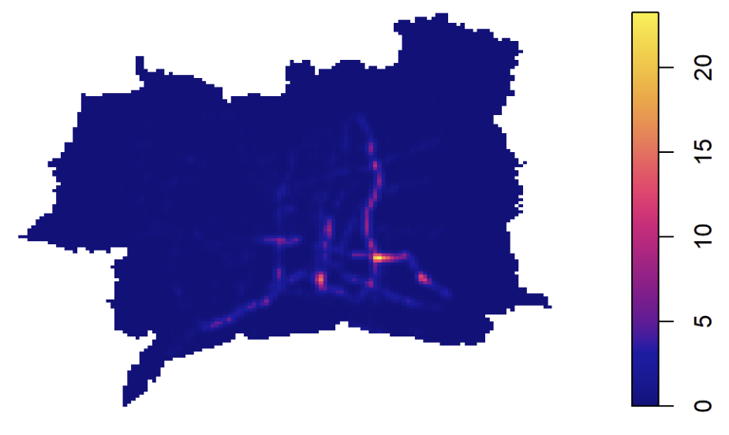
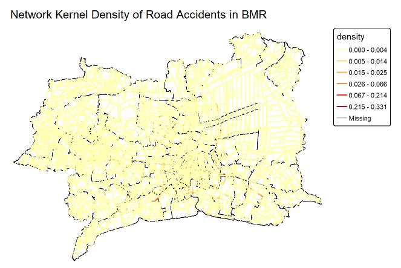
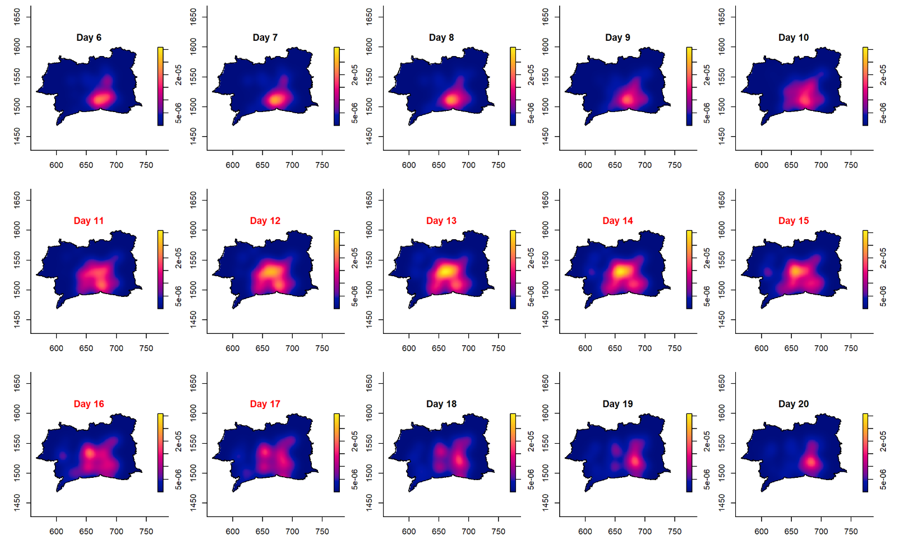
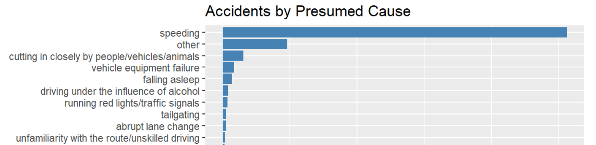

## Content Page {.center}

- Overview
- Research Question & Objectives
- Study Area & Data
- Analytical Approach
- Key Finding 1: Spatial Concentration
- Key Finding 2: Network-Level Hotspots
- Key Finding 3: Temporal Patterns
- Accident Characteristics
- Limitations
- Public-Safety Implications

## 1. Overview

- Road traffic accidents are a public-safety issue with a spatial and temporal signature
- Understanding **where** and **when** accidents concentrate can guide resource allocation
- This study applies spatial and spatio-temporal point-pattern analysis to road accidents in the Bangkok Metropolitan Region (BMR)

::: notes
Road traffic accidents are a public-safety issue, and importantly, they show a clear spatial and temporal signature. They tend to occur more in some locations than others, and more at some times than others.

This matters because understanding where and when accidents concentrate can directly guide how public-safety resources are allocated, for example, where to focus enforcement or road-safety measures, and when to increase them.

With that in mind, this study applies spatial and spatio-temporal point-pattern analysis to road accidents in the Bangkok Metropolitan Region for the year 2022, in order to identify these patterns and understand what they mean for public-safety planning.
:::

## 2. Research Questions

1.  How is accident intensity distributed across space and time in the BMR?
2.  Do accidents show significant clustering beyond complete spatial randomness?
3.  Does the road network change the interpretation of accident concentration?
4.  What do these patterns imply for public-safety planning?

::: notes
This study is guided by four research questions. First, how accident intensity is distributed across space and time within the Bangkok Metropolitan Region. Second, whether accidents show statistically significant clustering, beyond what would be expected under complete spatial randomness. Third, whether accounting for the road network changes how accident concentration should be interpreted, compared to treating accidents as freely distributed in space. Lastly, what these patterns imply for public-safety planning and resource allocation.
:::

## 3. Study Area & Data

**Study area:** Bangkok Metropolitan Region (BMR) — Bangkok, Nonthaburi, Nakhon Pathom, Pathum Thani, Samut Prakan, Samut Sakhon

**Study period:** 2022

**Data:**

| Dataset               | Format    | Source        |
|-----------------------|-----------|---------------|
| Road Accidents (2022) | CSV       | Kaggle        |
| Boundaries            | GeoJSON   | geoBoundaries |
| Road Network (OSM)    | Shapefile | Geofabrik     |

::: notes
The study area for this study is the Bangkok Metropolitan Region, which covers Bangkok itself along with five adjacent provinces: Nonthaburi, Nakhon Pathom, Pathum Thani, Samut Prakan, and Samut Sakhon. The study period was restricted to the year 2022.

Three datasets were used. Accident-level records were obtained from Kaggle, sourced from the Ministry of Transport's TRAMS dashboard, with only the 2022 subset used for this study. Administrative boundaries for these provinces and their districts were obtained from geoBoundaries. The road network was obtained as an OpenStreetMap extract from Geofabrik, classified by highway type.
:::

## 4. Analytical Approach

- **Data preparation:** clean, validate, and integrate accident, boundary, and road network data
- **First-order analysis:** examine how accident intensity varies across space (KDE, quadrat analysis)
- **Second-order analysis:** test for clustering beyond chance (Clark-Evans, G, F, K/L-functions)
- **Network-constrained analysis:** re-examine concentration along the road network (NKDE)
- **Spatio-temporal analysis:** examine how concentration evolves over time (STKDE)

::: notes
The analytical approach followed five main stages.

First, the accident, boundary, and road network data were cleaned, validated, and integrated into a form suitable for point-pattern analysis.

Second, first-order analysis was conducted to examine how accident intensity varies across space, using kernel density estimation and quadrat analysis.

Third, second-order analysis was conducted to test whether accidents exhibit clustering beyond what would be expected under complete spatial randomness, using the Clark-Evans test together with the G, F, and K and L-functions.

Fourth, network-constrained kernel density estimation was applied to re-examine this concentration specifically along the road network, rather than across open planar space.

Finally, spatio-temporal kernel density estimation was used to examine how this spatial concentration evolves across the year, including during key periods such as Songkran and the year-end holidays.
:::

## 5. Key Finding 1: Spatial Concentration

- Accident intensity is highly uneven across the BMR, concentrated in the central and central-eastern provinces
- Confirmed as genuine clustering: Clark-Evans (**R = 0.177**), quadrat analysis (**VMR = 176.6**), and G/F/K-L functions all show clustering within **0.1–0.5 km**

{fig-align="center" width="41%"}

::: notes
The first key finding concerns the spatial concentration of accidents. Kernel density estimation shows that accident intensity is highly uneven across the Bangkok Metropolitan Region, concentrated primarily in the central and central-eastern provinces.

Importantly, this concentration was confirmed to be genuine clustering, not simply an impression created by looking at a map. The Clark-Evans test returned an R value of 0.177, well below the value of 1 expected under complete spatial randomness. The quadrat analysis produced a variance-to-mean ratio of 176.6, far exceeding the value of 1 expected under a uniform process. In addition, the G, F, K and L-functions all confirmed significant clustering within short distances, roughly 0.1 to 0.5 kilometres, using Monte Carlo simulation envelopes.

Together, these results derived from different methods, all point to the same conclusion: accidents in the BMR are genuinely concentrated, both in terms of overall intensity and in terms of how closely individual accidents are positioned to one another.
:::

## 6. Key Finding 2: Network-Level Hotspots

- Accident density concentrated on a **small share of the road network**, not spread evenly across corridors
- Highlights specific highway segments and intersections in central and central-eastern BMR as hotspots
- Confirms clustering is a genuine feature of accident locations, not just an artefact of road placement

{fig-align="center" width="55%"}

::: notes
The second key finding builds on the first, using network-constrained kernel density estimation, applied specifically along the road network.

This analysis shows that accident density is concentrated on a small share of the road network, not spread evenly across entire corridors. Specific highway segments and intersections, mainly in the central and central-eastern parts of the Bangkok Metropolitan Region, stand out clearly as hotspots.

This result also strengthens the earlier finding of clustering. It confirms that the clustering identified through the spatial point-pattern tests is a genuine feature of accident locations, and not simply a side effect of roads being unevenly distributed across the region. In other words, accidents are not just clustering because that's where the roads happen to be, they are clustering more than the road network alone would explain.
:::

## 7. Key Finding 3: Temporal Patterns

- Accident density stays concentrated in central BMR **throughout the year**, but its intensity and spread change over time
- **December**: highest density of the year, coinciding with the year-end holiday period
- **Songkran (11–17 April)**: density spreads outward and peaks sharply

{fig-align="center" width="57%"}

::: notes
The third key finding concerns how accident concentration changes over time, using spatio-temporal kernel density estimation.

Across the year, accident density remains concentrated in the central Bangkok Metropolitan Region, but its intensity and spatial extent change from month to month. December shows the highest density of the year, which coincides with year-end holiday period.

A similar pattern appears during Songkran, Thailand's New Year festival, which falls within its own "Seven Dangerous Days" period in April. From the 11th to the 14th, accident density rises sharply and spreads outward from its usual compact area, reaching the sharpest and most widespread concentration seen in the month. From the 15th to the 17th, density begins to recede and splits into two separate zones, before gradually merging back into a single central area by the end of the month.

These patterns show that accident concentration is not constant throughout the year. It intensifies and spreads during specific known high-travel periods, which has direct implications for when public-safety resources should be increased.
:::

## 8. Accident Characteristics

- **Presumed cause:** Speeding is the most common cause for accidents
- **Accident type:** Rear-end collisions are the most common type
- **Weather:** Most accidents occurred under clear conditions

{fig-align="center" height="45%"}

::: notes
Beyond where and when accidents cluster, it is also worth understanding how these accidents happen, since this points toward specific types of interventions.

Speeding is the most common presumed cause of accidents, accounting for more accidents on its own than all other causes combined. Rear-end collisions are the most common accident type, followed by rollovers on straight roads. Most accidents also occurred under clear weather conditions, rather than during rain or poor visibility.

Together, these characteristics suggest that speed-related interventions, such as speed cameras, signage, or traffic calming, together with engineering improvements at the identified hotspot intersections, may be more directly relevant than weather-related measures.
:::

## 9. Data Limitations

- Restricted to **2022 only**; cannot confirm whether hotspots or seasonal patterns (e.g. Songkran, year-end) are specific to 2022 or persist across years
- Road network data is a **single snapshot**, which may not perfectly reflect the road network as it existed in 2022
- **Missing coordinates** were concentrated in accidents recorded by the Expressway Authority of Thailand, likely undercounting accidents on Bangkok's expressway network

::: notes
For this study, there are a few data limitations to take note.

First, this analysis is restricted to a single year, 2022. As such, it cannot be determined whether the identified hotspots and seasonal patterns, such as those observed during Songkran and the year-end period, persist across multiple years, or are specific to 2022 alone.

Second, rows with missing coordinates were concentrated in accidents recorded by the Expressway Authority of Thailand, largely within Bangkok. These accidents could not be placed spatially and were dropped from the analysis, meaning accidents on Bangkok's controlled-access expressway network are likely undercounted relative to the rest of the region.

Third, the road network data, obtained as an OpenStreetMap extract from Geofabrik, represents a single snapshot. It may not perfectly reflect the road network as it existed in 2022.
:::

## 10. Public-Safety Implications

- **Spatial:** target enforcement and engineering at the specific corridors where accidents concentrate
- **Temporal:** strengthen campaigns around known high-frequency periods, e.g. peak hours, weekends, and festive periods such as Songkran
- **Accident type:** prioritise speed enforcement and intersection improvements, given speeding and rear-end collisions dominate
- Pair these findings with **traffic-volume data** for a fuller picture of risk beyond concentration alone

::: notes
Road accidents in the BMR are not randomly distributed in space or time. Identifying where and when accidents concentrate allows resources such as police patrols, road engineering, and safety campaigns to be targeted at high-risk locations and periods, rather than distributed evenly across the region.

Accidents are statistically clustered, not just visually concentrated, as shown by the Clark-Evans test, the quadrat analysis, the G, F, K and L-functions, and the network-constrained kernel density estimation. As every method converges on the same conclusion, this supports targeting enforcement and road-safety engineering at the specific corridors where accidents concentrate.

Accident concentration also varies across time, not just space. Intensity is highest during peak hours and rises toward the weekend, with October to December recording the highest accident counts, and the Songkran festival period showing a sharp rise in both accident rate and spatial spread. Hence, instead of maintaining a constant level of resourcing year-round, enforcement and public-safety campaigns can be strengthened around these known periods of elevated accident frequency.

The type of accident also hints at what kind of interventions might help. Since speeding was the most commonly recorded cause, and rear-end collisions the most common accident type, speed enforcement measures and improvements at intersections in the identified hotspot areas may be more relevant than weather-related measures.

In summary, road accidents in the BMR are concentrated in specific corridors and time periods rather than occurring randomly. This provides a good starting point for targeting public-safety resources where and when they are most needed. Pairing these findings with traffic-volume data would further strengthen public-safety planning, offering a fuller picture of accident risk beyond concentration alone.
:::
