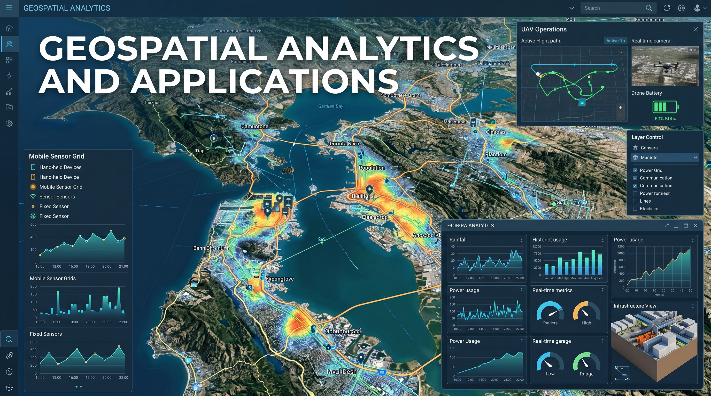

{fig-align="center" width="100%"}

## About this site

This site documents my coursework for ISSS626 Geospatial Analytics and Applications, including hands-on exercises, in-class exercises, and take-home exercises using R.

**Topics covered in this course:**

- Introduction to Geospatial Analytics
- Spatial Point Patterns Analysis (SPPA)
- Advanced Spatial Point Patterns Analysis
- Spatial Weights and Applications
- Global and Local Measures of Spatial Association
- Geographic Segmentation
- Geographically Weighted Explanatory Models
- Geographically Weighted Predictive Models
- Modelling Geographic Accessibility
- Spatial Interaction Models
